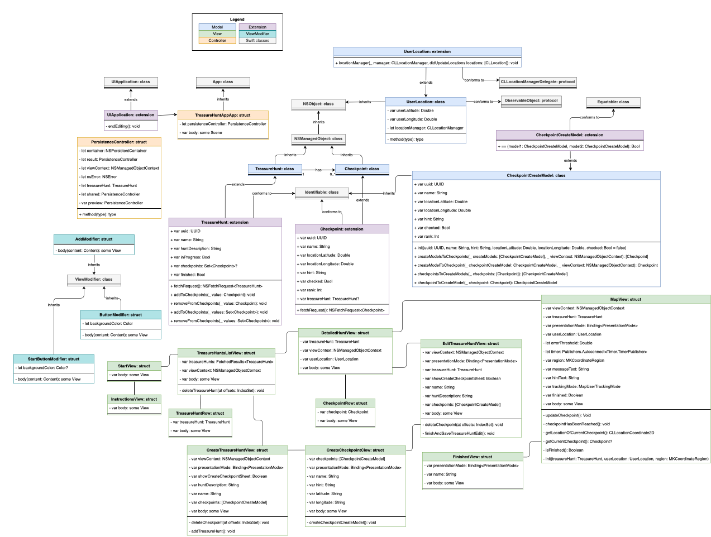
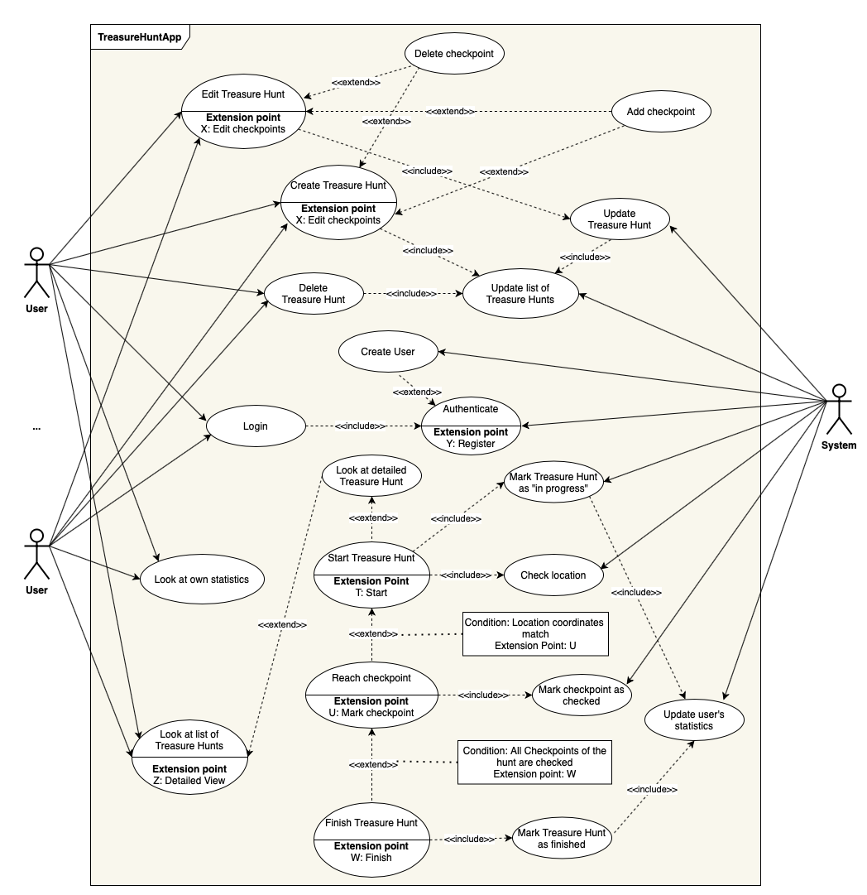

# Treasure Hunt App
"Forgeschrittene Softwaretechnik"  
WS 2020/2021

*
App Icon made by <a href="https://www.freepik.com" title="Freepik">Freepik</a> from <a href="https://www.flaticon.com/" title="Flaticon">www.flaticon.com</a>
*

**The Application**  

The app enables you to create own treasure hunts that you can use to go on little adventures with.  

You have a StartView from which you get to a list of available treasure hunts where you can also delete them.  
With the button at the bottom you can create new ones.   

     

This is what the view for creating a hunt looks like. You can pass in a name, description and also add several checkpoints.  

   

This is what the detailed view of a treasure hunt looks like. If the checkpoints haven't been reached/checked off yet they are hidden.  
With the edit option you can also change the hunts after you've created them (e.g. delete a checkpoint again).

   

Once you've started a hunt the MapView looks like this. When you've reached a checkpoint it will be annotated on the map with a pin and the detailed view will also be updated:  

   

When you've finished a treasure hunt a finished view will appearand the map will have all checkpoints visible. They can also be seen in the detailed view.  

    

**1. UML Diagrams**

All UML diagrams can be found in the [UML folder](https://github.com/vynguyen1/treasure-hunt-app-ds-20-21/tree/main/UML).  

1. For the Class Diagram click [here](https://github.com/vynguyen1/treasure-hunt-app-ds-20-21/tree/main/UML/Class_Diagram.png)  
	  
	 
2. For the Use-Case Diagram click [here](https://github.com/vynguyen1/treasure-hunt-app-ds-20-21/tree/main/UML/Use_Case_Diagram.png)  
	  
	 
3. For the Sequence Diagram click [here](https://github.com/vynguyen1/treasure-hunt-app-ds-20-21/tree/main/UML/Sequence_Diagram.png)  
	  

**2. Domain-Driven Design (DDD)**  
*In the making...*

**5. Metrics**  
For metrics SonarQube is used and Fastlane for gathering the SonarQube metrics. The configuration can be found in the [sonar-project.properties file](https://github.com/vynguyen1/treasure-hunt-app-ds-20-21/tree/main/sonar-project.properties). It, amongst other things, checks for Maintainability (Code Smells,...), Duplications and Code Coverage.  
The configuration for Swiftlint (a tool to enforce Swift style and conventions, used for the code smells metric) can be found in [.swiftlint.yml](https://github.com/vynguyen1/treasure-hunt-app-ds-20-21/tree/main/fastlane/.swiftlint.yml). This is also used with SonarQube.  

**6. Clean Code Development (CCD)**  
*In the making...*

**7. Build**  
For this project Fastlane is used which is an open source build automation tool for Android and iOS for developers. In [Gemfile](https://github.com/vynguyen1/treasure-hunt-app-ds-20-21/tree/main/Gemfile) we describe the gem dependencies required (like Fastlane).
The configuration files for Fastlane can be found in the [fastlane folder](https://github.com/vynguyen1/treasure-hunt-app-ds-20-21/tree/main/fastlane):

1. Appfile:  
	The Appfile stores useful information that are used across all fastlane tools (e.g. Apple ID, application Bundle Identifier,...) to deploy lanes faster and tailored on the project needs.
2. Fastfile:  
	The Fastfile stores the automation configuration that can be run with fastlane. Here you find different lanes I implemented. For example one for testing (and publishing the application reports to sonar), one for building (produces, amongst other things, an ipa file - an iOS application archive file which stores an iOS app - and puts it in a build folder in the jenkins workspace (local) and also a lane for testing swiftlint.
3. Scanfile:  
	Scan is an alias for the run_tests action. It's to run tests of the iOS app on a simulator or connected device. The configuration for that can be found in the Scanfile. Reports about the test results (in html and junit format) are put in the reports folder (also in the local workspace).
4. Gymfile:  
	Gym builds and packages iOS apps and is part of fastlane. It is an alias for the build_app action. The configuration for the build is done in this file.
5. Matchfile:  
	Match is an alias for the sync\_code\_signing action. It's to simplify the codesigning setup and prevent code signing issues across a team of developers (if there's more than one).

**8. Unit-Tests**  
See Test Folders: [Tests](https://github.com/vynguyen1/treasure-hunt-app-ds-20-21/tree/main/TreasureHuntAppTests) and [UITests](https://github.com/vynguyen1/treasure-hunt-app-ds-20-21/tree/main/TreasureHuntAppUITests)  

**9. Continuous Integration/Continuous Delivery (CI/CD)**  
For CI/CD Jenkins + Fastlane are used. The configuration/pipeline can be found in the [Jenkinsfile](https://github.com/vynguyen1/treasure-hunt-app-ds-20-21/tree/main/pipelines/Jenkinsfile).  
You can also see the different stages in Jenkins' stage view:  

And also the changes that have been made:  

When something is being pushed to the git repository a job in Jenkins is being triggered via webhook. Since Jenkins is run locally ngrok is used which provides public URLs (creates a secure tunnel from a public endpoint to a locally running web service).  

   

Defined recipients are notified via email when a build starts and also receive an email when a build has finished with the respective build status:  

   

**10. IDE**  
For this project XCode 12.2 was used. Some very useful shortcuts were the following:

| Shortcut      			| Description                    				  			|
| ------------------------- | --------------------------------------------------------- |
| Command+Shift+O   		| Open quickly: Find a file quickly and open it.   			|
| Option/Alt+Click  		| See the declaration of a variable.     		   			|
| Command+Click		    	| To jump to the definition of a variable/function etc., to e.g. embed View in HStack...	|
| Command+Option+Enter  	| Open/close the Preview window of Views.		   			|
| Command+Option+P		  	| Load Preview.		   										|
| Command+Shift+F		  	| Search for something in the project.				   		|
| Command+Shift+7	  		| Comment in/out blocks or lines of code.     	   			|
| Command+B			  		| Build. 							    		   			|
| Command+U			  		| Run Tests.						     		   			|

This project uses the framework SwiftUI to build user interfaces. With that we're also able to quickly modify and build our views with the preview feature and attributes inspector in Xcode.

**11. Domain-Specific Language (DSL)**  
You can find an example for internal DSL [here](https://github.com/vynguyen1/treasure-hunt-app-ds-20-21/blob/main/TreasureHuntApp/View/DSL-Example/DSL_Example.swift):  
SwiftUI itself is already kind of a DSL that simplifies building a UI. The implemented ViewModifiers in this project can be used to modify views by just simply adding, here for example, modifyAdd().  
It's a functional, Domain Specific Language for interface declaration.  

**12. Functional Programming**  
Only final data structures:  
All variables of the Viewmodels are declared as let variables which means they are final. Views are of type struct which are also immutable, so their var's are also final.
Use of higher-order functions (When functions are used as parameters and/or return values and closures / anonymous functions are used.):    
This is the case with the map, reduce and filter functions used on arrays. In this project see for example the use of filter in LocationComponent.getLocationOfCurrentCheckpoint() or closures as predicate parameter for the firstIndex function in CheckpointComponent.findCheckpoint().  
Also for example with buttons, functions are also given as closures for the action parameter. The functions are then being run when the button is clicked.
